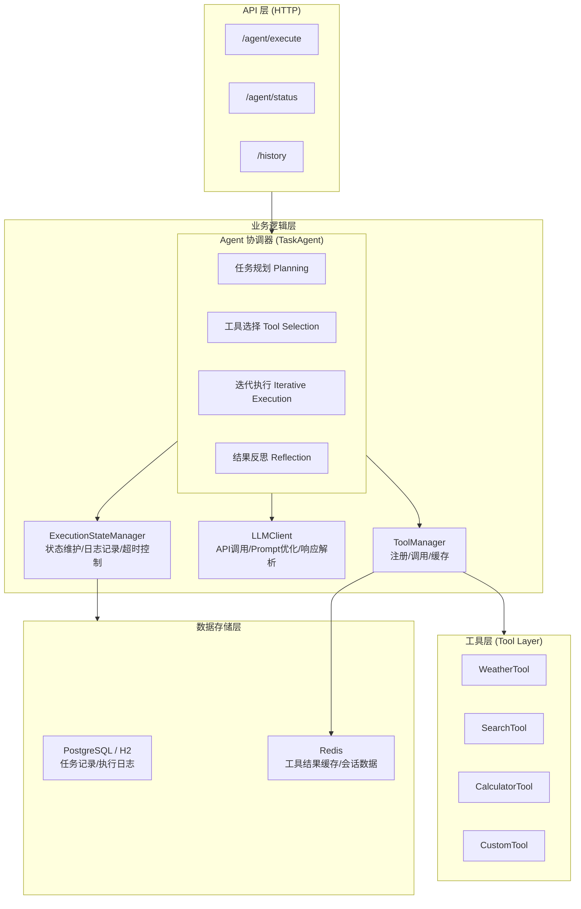
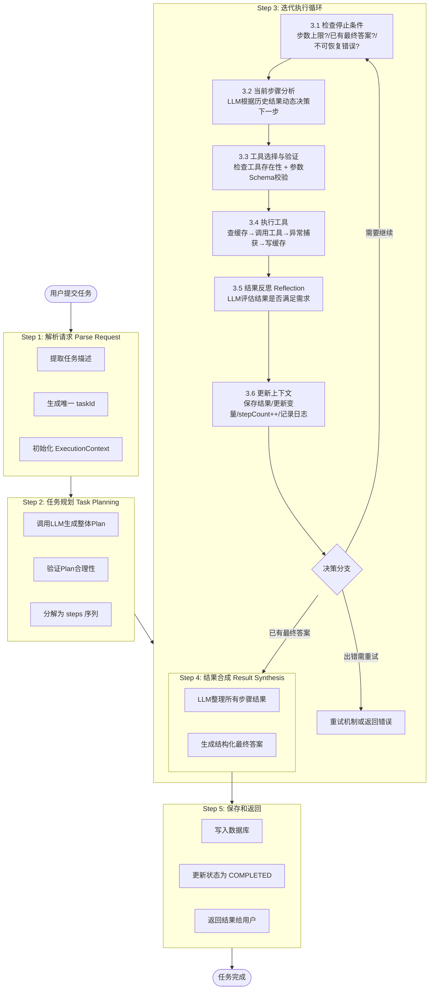

# TaskFlow AI - 智能任务执行系统
## 产品需求文档 (PRD)

**版本**: v1.0  
**作者**: 项目团队  
**创建日期**: 2026-05-18  
**最后更新**: 2026-05-18  

---

## 1. 项目概述

### 1.1 项目简介

TaskFlow AI 是一个**自主智能任务执行系统**，基于大语言模型的推理能力，实现Agent的自动任务分解、工具选择和执行。用户提交一个复杂的自然语言需求后，系统能够：

1. **理解需求** - 解析用户意图
2. **规划步骤** - 分解为多个子任务
3. **选择工具** - 根据每步需求选择合适的工具
4. **执行调用** - 依次执行工具获得结果
5. **整合反思** - 对结果进行验证和修正
6. **生成答案** - 输出最终的结构化结果

### 1.2 核心理念：ReAct 模式

系统遵循 **ReAct (Reasoning + Acting)** 推理框架：

思考 (Think) ↓ Agent分析当前状态和目标 行动 (Action) ↓ 选择工具执行操作 观察 (Observation) ↓ 获得工具执行结果 反思 (Reflect) ↓ 评估结果是否符合预期 ↓ (循环或结束)

Code

### 1.3 应用场景

| 场景 | 示例 | 涉及工具 |
|------|------|---------|
| **信息查询** | "查询北京今天天气，推荐穿衣" | 天气API、推理生成 |
| **数据分析** | "统计过去30天的销售数据，找出增长最快的产品" | 数据库查询、分析计算 |
| **自动化流程** | "从Excel读取客户信息，批量发送邮件" | 文件操作、邮件服务 |
| **搜索与整理** | "搜索Python文件处理最佳实践，整理成文档" | 网络搜索、文件写入 |
| **知识问答** | "根据我的代码库，这个错误怎么修复？" | 代码搜索、知识库检索 |

---

## 2. 需求分析

### 2.1 功能需求

#### 2.1.1 核心功能 (MVP - Minimum Viable Product)

**F1: Agent 任务执行引擎**
- 接收用户的任务描述（自然语言）
- 调用LLM分析任务，生成执行计划
- 根据计划自动选择和调用工具
- 基于工具结果进行迭代和修正
- 最终输出结构化的执行结果

**F2: 工具管理系统**
- 支持注册和管理多个Tool实例
- 每个Tool有清晰的输入输出Schema
- Tool可动态加载和卸载
- Tool执行结果缓存机制

**F3: 工作流执行引擎**
- 维护执行状态机（初始化→执行中→完成/失败）
- 支持最多N步的迭代执行
- 在超出步数限制时正常退出
- 记录每一步的执行日志

**F4: API 接口**
- `/api/v1/agent/execute` - 提交任务执行
- `/api/v1/agent/status/{taskId}` - 查询执行状态
- `/api/v1/agent/history` - 获取执行历史
- `/api/v1/tools` - 获取已注册的工具列表

#### 2.1.2 扩展功能 (Phase 2)

**F5: 执行历史和追踪**
- 持久化保存任务执行全过程
- 提供执行链的可视化查询
- 支持执行结果的重新执行

**F6: 性能优化**
- Tool调用结果缓存
- 异步执行支持
- 执行超时控制

**F7: 错误恢复**
- Tool调用失败的重试机制
- 优雅的降级处理
- 清晰的错误信息反馈

### 2.2 非功能需求

| 需求 | 指标 | 说明 |
|------|------|------|
| **可用性** | ≥ 99% | 系统正常运行时间 |
| **响应时间** | < 5s | 简单任务执行时间 |
| **并发支持** | ≥ 10 QPS | 支持至少10个并发请求 |
| **可扩展性** | Tool 即插即用 | 新增Tool无需修改核心代码 |
| **可维护性** | 代码覆盖率 ≥ 70% | 单元测试覆盖主要逻辑 |
| **安全性** | API 鉴权 | 支持API Key验证 |

---

## 3. 系统设计

### 3.1 架构设计



### 3.2 核心模块设计

#### 3.2.1 Agent 模块 (TaskAgent)

**职责**: 协调整个任务执行流程

**关键方法**:
```java
// 主执行方法
TaskResult execute(TaskRequest request)

// 子方法
Plan planTask(String taskDescription)        // 任务规划
String selectTool(Plan step)                 // 工具选择
ToolResult invokeTool(String toolName, Map params)  // 调用工具
boolean shouldContinue(ExecutionContext ctx) // 是否继续迭代
String synthesizeResult(List<ToolResult> results)   // 结果合成
#### 3.2.2 Tool 管理模块 (ToolManager)
职责: 管理所有可用的工具

关键数据结构:

Java
interface Tool {
    String getName()                    // 工具名称
    String getDescription()             // 工具描述
    Map<String, Parameter> getInputSchema()  // 输入参数定义
    ToolResult execute(Map<String, Object> params) // 同步执行工具
    CompletableFuture<ToolResult> executeAsync(Map<String, Object> params) // 异步执行（默认实现委托给 execute）

    // 工具元信息
    long getTimeoutMs()                 // 该工具的超时时间（毫秒），默认 30s
    int getMaxRetries()                 // 最大重试次数，默认 0（不可重试）
    boolean isIdempotent()              // 该工具调用是否幂等，默认 false
}

class ToolManager {
    void registerTool(Tool tool)        // 注册工具
    Tool getTool(String name)           // 获取工具
    List<Tool> listAvailableTools()     // 列出所有工具
    Map<String, Tool> getAllTools()     // 获取所有工具
}
#### 3.2.3 LLM 调用模块 (LLMClient)
职责: 与大语言模型交互

关键方法:

Java
class LLMClient {
    // 完成对话
    String chat(String prompt, ChatOptions options)
    
    // 结构化输出 (返回JSON)
    <T> T chatWithSchema(String prompt, Class<T> schemaClass)
    
    // 流式输出
    void streamChat(String prompt, StreamCallback callback)
}
#### 3.2.4 执行上下文 (ExecutionContext)
职责: 维护单次任务执行的所有状态

关键属性:

Java
class ExecutionContext {
    String taskId                       // 任务ID
    String traceId                      // 链路追踪ID，贯穿全部日志
    String originalTask                 // 原始任务描述
    List<Step> executionHistory         // 执行历史
    Map<String, Object> variables       // 中间变量存储
    int stepCount                       // 当前步数
    int retryCount                      // 当前重试次数
    int maxSteps                        // 最大步数限制
    Instant startTime                   // 开始时间
    Instant expiresAt                   // 上下文过期时间（避免内存泄漏）
    ExecutionStatus status              // 执行状态
    String finalResult                  // 最终结果
}
#### 3.2.5 数据存储模块 (Repository)
职责: 持久化保存执行数据

关键方法:

Java
interface TaskRepository {
    void saveTask(TaskExecution execution)
    TaskExecution getTaskById(String taskId)
    List<TaskExecution> listRecentTasks(int limit)
    void updateTaskStatus(String taskId, ExecutionStatus status)
}
### 3.3 执行流程设计
系统采用 **plan-then-execute + 动态调整** 的混合模式：

1. **Plan-then-execute（宏观规划）**：先由 LLM 生成整体执行计划（Plan），作为全局蓝图
2. **Plan-as-you-go（微观调整）**：每步执行前再次调用 LLM，根据上一步的实际结果动态调整当前步骤的 tool 和参数，而非机械执行初始 Plan

这种混合模式兼顾了规划的全局视野与执行的灵活应变。


### 3.4 Prompt 设计
#### 3.4.1 任务规划 Prompt
Code
用户任务: {userTask}

请分析这个任务，规划完成它需要的步骤。
每个步骤应该明确指出：
1. 需要使用的工具
2. 工具的参数
3. 预期的输出

可用的工具有: {toolsList}

请以JSON格式返回规划方案:
{
  "analysis": "对任务的分析",
  "steps": [
    {
      "step_id": 1,
      "description": "步骤描述",
      "tool": "工具名称",
      "parameters": {
        "param1": "值",
        "param2": "值"
      },
      "expected_output": "预期输出格式"
    }
  ]
}
#### 3.4.2 工具选择 Prompt
Code
当前目标: {currentObjective}
已有信息: {previousResults}
可用工具: {toolsList}

根据当前情况，选择下一步应该使用的工具。

返回JSON格式:
{
  "reasoning": "选择这个工具的原因",
  "selected_tool": "工具名称",
  "parameters": {
    "param1": "值"
  },
  "should_continue": true/false,
  "confidence": 0.8
}
#### 3.4.3 结果判断 Prompt
Code
原始任务: {originalTask}
已执行步骤: {executionHistory}
最新结果: {latestResult}

评估这个结果是否充分回答了原始任务。

返回JSON格式:
{
  "is_sufficient": true/false,
  "reasoning": "分析理由",
  "next_steps_needed": ["如果不充分，需要的下一步"],
  "confidence": 0.9
}

### 3.5 安全设计

#### 3.5.1 API 鉴权

系统通过 API Key 进行请求鉴权，设计如下：

| 配置项 | 说明 |
|--------|------|
| Key 传递方式 | HTTP Header: `X-API-Key` |
| Key 存储 | 环境变量 / Kubernetes Secret，不硬编码 |
| 验证方式 | Spring Interceptor 统一拦截，校验失败返回 401 |
| Key 轮换 | 支持多 Key 共存以实现平滑轮换 |

**401 响应示例**：
```json
{
  "code": "UNAUTHORIZED",
  "message": "API Key 无效或缺失",
  "traceId": "abc-123-def-456"
}
```

#### 3.5.2 安全防护措施

| 防护项 | 措施 |
|--------|------|
| SQL 注入 | DatabaseTool 仅允许 SELECT 查询，使用参数化查询；其他工具输入需做合法性校验 |
| 命令注入 | FileOperationTool 限制操作路径在白名单目录内 |
| SSRF | HTTP 出站请求限制目标域名/IP 白名单 |
| 速率限制 | 基于 API Key 的令牌桶限流（默认 60 req/min） |
| 参数校验 | 所有 API 入参使用 Bean Validation (JSR-303) |

### 3.6 缓存策略

#### 3.6.1 缓存层次

| 层级 | 存储 | TTL | 用途 |
|------|------|-----|------|
| L1 — 本地缓存 | Caffeine | 5 min | 热点工具结果，进程内最快 |
| L2 — 分布式缓存 | Redis | 30 min | 跨实例共享的工具结果 |

#### 3.6.2 缓存 Key 设计

```
tool_cache:{toolName}:{paramsHash}
```
- `toolName` — 工具名称
- `paramsHash` — 参数字典序排列后的 MD5

#### 3.6.3 缓存策略细节

| 场景 | 策略 |
|------|------|
| 缓存穿透 | 对不存在的结果缓存空值，TTL 缩短为 30s |
| 缓存击穿 | 热点 Key 使用互斥锁 (`SETNX`)，仅一个线程回源 |
| 缓存雪崩 | 各 Key TTL 增加随机偏移 (TTL ± 10%) |
| 一致性 | Tool 执行结果为事实数据，无更新场景，无需考虑一致性问题 |

### 3.7 并发控制设计

#### 3.7.1 执行隔离模型

每个任务执行过程维护独立的 `ExecutionContext`，序列化存储在 Redis 中以保证水平扩展时无状态：

```
execution:ctx:{taskId}  → JSON 序列化的 ExecutionContext
```

- **TTL**：任务完成后保留 1 小时用于查询，超时自动清除
- **锁机制**：同一 taskId 的 Context 写入使用 Redis 分布式锁 (`SETNX`)，防止并发写入冲突

#### 3.7.2 请求幂等性

客户端可传入 `X-Idempotency-Key` 请求头，避免网络超时重试导致的重复任务：

```
幂等性 Key → 首次请求创建任务，后续相同 Key 直接返回已有 taskId
```

- 幂等 Key 有效期：24 小时
- 存储：Redis `idempotency:{key}` → `taskId`

## 4. 技术选型
4.1 编程语言和框架
组件	技术选择	版本	原因
语言	Java	21+	类型安全、生态完善、性能好
Web框架	Spring Boot	3.x	生产级框架，易于快速开发
HTTP客户端	OkHttp / HttpClient	最新	高效的HTTP通信
JSON处理	Jackson	2.x	功能完整，性能高
数据库	PostgreSQL (生产) / H2 (开发) + JPA	-	PostgreSQL支持高并发写入；H2用于本地开发与测试
缓存	Caffeine / Redis	-	内存缓存，提升性能
日志	Logback + SLF4J	-	标准日志方案
测试	JUnit 5 + Mockito	-	完整的测试框架
构建工具	Maven	-	项目依赖管理
4.2 外部服务
服务	选项	用途
LLM	OpenAI / DeepSeek / 阿里通义	Agent推理引擎
天气API	和风天气 / OpenWeatherMap	天气查询工具
搜索API	SerpAPI / Bing Search	网络搜索工具
其他	按需集成	数据库查询、邮件等
## 5. 数据模型
### 5.1 核心实体
5.1.1 任务执行记录 (TaskExecution)
Java
@Entity
class TaskExecution {
    @Id
    String taskId;                          // 唯一标识
    String originalTask;                    // 原始任务描述
    ExecutionStatus status;                 // 执行状态
    LocalDateTime createdAt;                // 创建时间
    LocalDateTime completedAt;              // 完成时间
    String finalResult;                     // 最终结果
    int totalSteps;                         // 总步数
    long executionTimeMs;                   // 执行耗时
    String errorMessage;                    // 错误信息(如有)
}
5.1.2 执行步骤记录 (ExecutionStep)
Java
@Entity
class ExecutionStep {
    @Id
    Long id;
    String taskId;                          // 关联的任务
    int stepIndex;                          // 步序号
    String action;                          // 执行的动作
    String toolName;                        // 使用的工具名
    String inputParams;                     // 输入参数(JSON)
    String outputResult;                    // 输出结果(JSON)
    long executionTimeMs;                   // 执行耗时
    LocalDateTime createdAt;                // 创建时间
    boolean success;                        // 是否成功
    String errorMessage;                    // 错误信息(如有)
}
5.1.3 工具定义 (ToolDefinition)
Java
class ToolDefinition {
    String name;                            // 工具名称
    String description;                     // 工具描述
    Map<String, ParameterSchema> inputSchema;  // 输入参数定义
    String outputFormat;                    // 输出格式说明
    String category;                        // 工具分类
}
5.2 枚举定义
Java
enum ExecutionStatus {
    PENDING,        // 待执行
    RUNNING,        // 执行中
    COMPLETED,      // 已完成
    FAILED,         // 执行失败
    TIMEOUT         // 超时
}
## 6. API 设计
### 6.1 REST API 规范
#### 6.1.1 执行任务
Code
POST /api/v1/agent/execute

请求头:
  X-Idempotency-Key: <optional-idempotency-key>  // 可选，用于幂等性控制
  X-API-Key: <api-key>                            // 必填，API鉴权

请求体:
{
  "task": "查询北京今天的天气，然后推荐穿衣搭配",
  "timeout": 30,           // 超时时间(秒)，可选
  "maxSteps": 10          // 最大执行步数，可选
}

成功响应 (202 Accepted):
{
  "taskId": "task_20260518_abc123",
  "status": "PENDING",
  "createdAt": "2026-05-18T10:30:00Z",
  "message": "任务已提交，请使用taskId查询执行结果"
}

错误响应 (400):
{
  "code": "INVALID_TASK",
  "message": "任务描述不能为空"
}
#### 6.1.2 查询执行状态
Code
GET /api/v1/agent/status/{taskId}

成功响应 (200):
{
  "taskId": "task_20260518_abc123",
  "status": "COMPLETED",
  "originalTask": "查询北京今天的天气...",
  "result": {
    "weather": "晴天，25℃",
    "recommendation": "建议穿短袖T恤..."
  },
  "executionSteps": 3,
  "executionTimeMs": 2300,
  "createdAt": "2026-05-18T10:30:00Z",
  "completedAt": "2026-05-18T10:30:02.3Z"
}

任务进行中 (200):
{
  "taskId": "task_20260518_abc123",
  "status": "RUNNING",
  "progress": {
    "currentStep": 2,
    "totalSteps": 3,
    "lastUpdate": "2026-05-18T10:30:01Z"
  }
}

任务不存在 (404):
{
  "code": "TASK_NOT_FOUND",
  "message": "任务ID不存在"
}
#### 6.1.3 获取执行历史
Code
GET /api/v1/agent/history?limit=10&offset=0

成功响应 (200):
{
  "total": 42,
  "limit": 10,
  "offset": 0,
  "tasks": [
    {
      "taskId": "task_20260518_abc123",
      "task": "查询北京天气...",
      "status": "COMPLETED",
      "executionTimeMs": 2300,
      "createdAt": "2026-05-18T10:30:00Z"
    },
    ...
  ]
}
#### 6.1.4 获取可用工具列表
Code
GET /api/v1/tools

成功响应 (200):
{
  "tools": [
    {
      "name": "weather",
      "description": "查询天气信息",
      "category": "query",
      "inputSchema": {
        "city": {
          "type": "string",
          "description": "城市名称",
          "required": true
        }
      },
      "example": {
        "input": {"city": "北京"},
        "output": {"temperature": 25, "condition": "晴天"}
      }
    },
    {
      "name": "search",
      "description": "网络搜索",
      "category": "search",
      "inputSchema": {
        "query": {
          "type": "string",
          "description": "搜索关键词",
          "required": true
        }
      }
    },
    ...
  ]
}
#### 6.1.5 获取任务详情（含执行步骤）
Code
GET /api/v1/agent/{taskId}/details

成功响应 (200):
{
  "taskId": "task_20260518_abc123",
  "originalTask": "查询北京今天的天气...",
  "status": "COMPLETED",
  "steps": [
    {
      "stepIndex": 1,
      "action": "调用天气API",
      "tool": "weather",
      "input": {"city": "北京"},
      "output": {"temperature": 25, "condition": "晴天", "humidity": 60},
      "executionTimeMs": 1200,
      "timestamp": "2026-05-18T10:30:00.5Z"
    },
    {
      "stepIndex": 2,
      "action": "生成穿衣建议",
      "tool": "reasoning",
      "input": {"weather": "晴天，25℃，湿度60%"},
      "output": {"recommendation": "建议穿短袖T恤和七分裤..."},
      "executionTimeMs": 1100,
      "timestamp": "2026-05-18T10:30:01.7Z"
    }
  ],
  "totalExecutionTimeMs": 2300
}
### 6.2 HTTP 状态码规范
状态码	含义	场景
200	OK	任务查询成功、工具列表获取成功
202	Accepted	异步任务已接受
400	Bad Request	请求参数错误
404	Not Found	任务不存在
408	Request Timeout	任务执行超时
429	Too Many Requests	请求过于频繁
500	Internal Server Error	服务器错误
503	Service Unavailable	服务暂时不可用

### 6.3 统一错误码体系

所有错误响应均包含 `code`、`message` 和 `traceId` 字段，格式如下：

```json
{
  "code": "ERROR_CODE",
  "message": "人类可读的错误描述",
  "traceId": "唯一追踪ID，便于定位日志"
}
```

#### 6.3.1 错误码枚举

| 错误码 | HTTP 状态码 | 说明 | 处理建议 |
|--------|------------|------|---------|
| `TASK_EMPTY` | 400 | 任务描述为空 | 检查请求体中的 task 字段 |
| `TASK_TOO_LONG` | 400 | 任务描述超长（>5000字符） | 缩短任务描述 |
| `TOOL_NOT_FOUND` | 400 | Agent 请求的工具未注册 | 检查 tool name 或确认工具已加载 |
| `TOOL_TIMEOUT` | 500 | 工具执行超时 | 增加超时时间或更换工具 |
| `UNAUTHORIZED` | 401 | API Key 无效或缺失 | 检查 X-API-Key 请求头 |
| `FORBIDDEN` | 403 | 权限不足 | 确认 API Key 有对应权限 |
| `RATE_LIMITED` | 429 | 请求频率超限 | 降低请求频率，等待后重试 |
| `TASK_NOT_FOUND` | 404 | 任务 ID 不存在 | 检查 taskId 是否正确 |
| `TASK_TIMEOUT` | 408 | 任务执行总超时 | 简化任务或增加 timeout 参数 |
| `STEP_LIMIT_EXCEEDED` | 422 | 超过最大执行步数 | 增加 maxSteps 或简化任务 |
| `LLM_UNAVAILABLE` | 502 | LLM 服务不可用 | 稍后重试，系统自动降级 |
| `INTERNAL_ERROR` | 500 | 内部未知错误 | 记录 traceId，联系管理员 |

## 7. 工具集合设计
7.1 内置工具清单
Tool 1: 天气查询工具 (WeatherTool)
功能: 查询指定城市的天气信息
输入参数:
city (string) - 城市名称，必需
details (boolean) - 是否获取详细信息，可选
输出格式: JSON
JSON
{
  "city": "北京",
  "temperature": 25,
  "condition": "晴天",
  "humidity": 60,
  "windSpeed": 10,
  "uvIndex": 7
}
调用API: 和风天气API
Tool 2: 网络搜索工具 (SearchTool)
功能: 在互联网上搜索信息
输入参数:
query (string) - 搜索关键词，必需
resultCount (int) - 返回结果数，默认5
输出格式: JSON数组
JSON
{
  "results": [
    {
      "title": "结果标题",
      "url": "https://example.com",
      "snippet": "摘要内容...",
      "rank": 1
    }
  ]
}
调用API: SerpAPI 或 Bing Search
Tool 3: 计算器工具 (CalculatorTool)
功能: 执行数学计算
输入参数:
expression (string) - 数学表达式，必需
输出格式: 数值
JSON
{
  "expression": "2 + 3 * 4",
  "result": 14,
  "latex": "2 + 3 \\times 4 = 14"
}
实现方式: 表达式解析库 (如 exp4j)
Tool 4: 数据库查询工具 (DatabaseTool)
功能: 查询关系数据库中的数据
输入参数:
query (string) - SQL查询语句，必需
limit (int) - 返回行数限制，可选
输出格式: 表格数据
JSON
{
  "columns": ["id", "name", "sales"],
  "rows": [
    [1, "产品A", 1000],
    [2, "产品B", 2000]
  ],
  "rowCount": 2
}
安全性: 只允许SELECT查询，防止注入
Tool 5: 文件操作工具 (FileOperationTool)
功能: 读写本地文件
输入参数 (读):
operation (string) - "read"
filePath (string) - 文件路径
输入参数 (写):
operation (string) - "write"
filePath (string) - 文件路径
content (string) - 文件内容
输出格式:
JSON
{
  "success": true,
  "content": "文件内容或写入确认",
  "size": 1024
}
Tool 6: JSON 处理工具 (JsonTool)
功能: 解析和提取JSON数据
输入参数:
jsonData (string) - JSON字符串
path (string) - JSON路径 (如 "data.user.name")
输出格式:
JSON
{
  "success": true,
  "value": "提取的值",
  "type": "string"
}
7.2 工具扩展机制
系统支持自定义工具的注册，流程如下：

Java
// 开发者创建自定义Tool
public class CustomTool implements Tool {
    @Override
    public String getName() {
        return "my_custom_tool";
    }
    
    @Override
    public String getDescription() {
        return "自定义工具描述";
    }
    
    @Override
    public Map<String, ParameterSchema> getInputSchema() {
        // 定义输入参数
    }
    
    @Override
    public ToolResult execute(Map<String, Object> params) {
        // 实现业务逻辑
        return new ToolResult(...);
    }
}

// 在应用启动时注册
toolManager.registerTool(new CustomTool());
## 8. 实现计划
### 8.1 开发阶段划分
Phase 1: 基础框架 (第1-2周)
 创建Spring Boot项目结构
 实现Agent核心执行引擎
 实现ToolManager和工具注册机制
 实现LLMClient与OpenAI API集成
 编写基本单元测试
 实现3-4个内置工具
完成标准: 能通过HTTP API提交任务并获得结果

Phase 2: 功能完善 (第3周)
 扩展工具集合（添加搜索、数据库等）
 实现数据库持久化
 实现执行历史查询接口
 添加错误处理和重试机制
 编写集成测试
 编写API文档
完成标准: 功能完整，支持任务历史查询和错误恢复

Phase 3: 优化和部署 (第4周)
 性能优化（缓存、异步执行）
 超时控制和资源限制
 安全性加固（API鉴权、参数验证）
 完整的系统测试
 编写部署文档
 创建Docker镜像
 优化README和代码注释
完成标准: 生产就绪，可部署到服务器

8.2 代码结构
Code
taskflow-ai/
├── pom.xml                          # Maven配置
├── README.md                        # 项目说明
├── docs/
│   ├── 需求文档.md                 # 本文件
│   ├── API_文档.md                  # API详细文档
│   ├── 架构设计.md                  # 详细架构设计
│   └── 部署指南.md                  # 部署和运行指南
├── src/
│   ├── main/java/com/taskflow/
│   │   ├── controller/              # HTTP 控制器
│   │   │   └── TaskAgentController.java
│   │   ├── service/                 # 业务逻辑层
│   │   │   ├── TaskAgentService.java
│   │   │   ├── ToolManager.java
│   │   │   └── LLMClient.java
│   │   ├── agent/                   # Agent核心
│   │   │   ├── TaskAgent.java
│   │   │   ├── ExecutionContext.java
│   │   │   ├── ExecutionStep.java
│   │   │   └── Plan.java
│   │   ├── tool/                    # 工具实现
│   │   │   ├── Tool.java            # Tool接口
│   │   │   ├── ToolResult.java
│   │   │   ├── impl/
│   │   │   │   ├── WeatherTool.java
│   │   │   │   ├── SearchTool.java
│   │   │   │   ├── CalculatorTool.java
│   │   │   │   ├── DatabaseTool.java
│   │   │   │   └── FileOperationTool.java
│   │   │   └── registry/
│   │   │       └── ToolRegistry.java
│   │   ├── entity/                  # 数据实体
│   │   │   ├── TaskExecution.java
│   │   │   └── ExecutionStep.java
│   │   ├── repository/              # 数据访问层
│   │   │   ├── TaskExecutionRepository.java
│   │   │   └── ExecutionStepRepository.java
│   │   ├── dto/                     # 数据传输对象
│   │   │   ├── TaskRequest.java
│   │   │   ├── TaskResponse.java
│   │   │   └── TaskDetailResponse.java
│   │   ├── exception/               # 自定义异常
│   │   │   ├── TaskExecutionException.java
│   │   │   └── ToolInvocationException.java
│   │   ├── config/                  # 配置类
│   │   │   ├── WebConfig.java
│   │   │   └── LLMConfig.java
│   │   └── Application.java         # 启动类
│   ├── resources/
│   │   ├── application.yml          # 应用配置
│   │   └── logback.xml              # 日志配置
│   └── test/java/com/taskflow/      # 单元测试
│       ├── service/
│       │   └── TaskAgentServiceTest.java
│       ├── tool/
│       │   └── ToolManagerTest.java
│       └── controller/
│           └── TaskAgentControllerTest.java
├── examples/                        # 使用示例
│   ├── curl_examples.sh             # curl示例
│   └── client_example.java          # Java客户端示例
└── docker/
    ├── Dockerfile
    └── docker-compose.yml
## 9. 测试策略
### 9.1 单元测试
测试每个Tool的execute方法
测试ToolManager的注册和查询功能
测试ExecutionContext的状态转移
目标覆盖率: ≥ 70%
9.2 集成测试
测试完整的任务执行流程
测试多步工具调用
测试错误恢复机制
模拟真实的LLM调用
9.3 API测试
使用Postman或curl测试所有REST接口
验证请求验证和错误处理
测试并发请求处理
负载测试
9.4 测试用例示例
Java
@Test
void testTaskExecution_WeatherQuery() {
    // 给定
    String task = "查询北京的天气";
    
    // 当
    TaskResult result = taskAgentService.executeTask(task);
    
    // 那么
    assertNotNull(result.getTaskId());
    assertEquals(ExecutionStatus.COMPLETED, result.getStatus());
    assertNotNull(result.getResult());
    assertTrue(result.getExecutionTimeMs() < 5000);
}

@Test
void testMultiStepExecution() {
    // 给定一个需要多步执行的复杂任务
    String task = "查询北京天气后，推荐穿衣搭配";
    
    // 当
    TaskResult result = taskAgentService.executeTask(task);
    
    // 那么
    assertEquals(ExecutionStatus.COMPLETED, result.getStatus());
    assertGreaterThan(result.getExecutionSteps().size(), 1);
    // 验证包含了两个不同的Tool调用
    assertTrue(result.getExecutionSteps().stream()
        .map(Step::getToolName)
        .distinct()
        .count() >= 2);
}

@Test
void testErrorHandling_InvalidTool() {
    // 给定Agent尝试调用一个不存在的工具
    Map<String, Object> params = Map.of("tool", "nonexistent_tool");
    
    // 那么应该捕获异常
    assertThrows(ToolInvocationException.class, () -> {
        toolManager.getTool("nonexistent_tool");
    });
}
## 10. 部署和运维
### 10.1 部署方式
10.1.1 本地开发环境
bash
# 克隆项目
git clone https://github.com/yourname/taskflow-ai.git

# 编译运行
mvn clean install
mvn spring-boot:run

# 服务启动在 http://localhost:8080
10.1.2 Docker 部署
bash
# 构建镜像
docker build -t taskflow-ai:latest .

# 运行容器
docker run -p 8080:8080 \
  -e OPENAI_API_KEY=your_key \
  -e DATABASE_URL=jdbc:sqlite:/data/taskflow.db \
  taskflow-ai:latest
10.1.3 Kubernetes 部署
YAML
# deployment.yaml
apiVersion: apps/v1
kind: Deployment
metadata:
  name: taskflow-ai
spec:
  replicas: 3
  selector:
    matchLabels:
      app: taskflow-ai
  template:
    metadata:
      labels:
        app: taskflow-ai
    spec:
      containers:
      - name: taskflow-ai
        image: taskflow-ai:latest
        ports:
        - containerPort: 8080
        env:
        - name: OPENAI_API_KEY
          valueFrom:
            secretKeyRef:
              name: taskflow-secrets
              key: openai-api-key
10.2 配置管理
YAML
# application.yml (生产环境)
spring:
  application:
    name: taskflow-ai
  jpa:
    database-platform: org.hibernate.dialect.PostgreSQLDialect
    hibernate:
      ddl-auto: validate
  datasource:
    url: jdbc:postgresql://${DB_HOST:localhost}:5432/taskflow
    username: ${DB_USER}
    password: ${DB_PASSWORD}

# --- 开发环境 profile ---
# spring.jpa.hibernate.ddl-auto: update
# spring.datasource.url: jdbc:h2:mem:taskflow

server:
  port: 8080
  servlet:
    context-path: /

taskflow:
  agent:
    max-steps: 10
    timeout-seconds: 30
    cache-enabled: true
    idempotency-enabled: true     # 幂等性检查
  
  llm:
    provider: openai  # openai | deepseek | aliyun
    model: gpt-4o
    temperature: 0.7
    max-tokens: 2000
  
  auth:
    enabled: true                  # 是否启用 API Key 鉴权
    header-name: X-API-Key         # API Key 的请求头名称
  
  tools:
    weather:
      enabled: true
      api-key: ${WEATHER_API_KEY}
    search:
      enabled: true
      api-key: ${SEARCH_API_KEY}
  
  observability:
    metrics:
      enabled: true
    tracing:
      enabled: true                # 是否生成 traceId
### 10.3 可观测性设计

#### 10.3.1 日志规范

| 级别 | 场景 | 示例 |
|------|------|------|
| INFO | 任务开始/结束、工具调用、缓存命中 | `task started, taskId=xxx` |
| WARN | 超时、重试、降级触发 | `tool timeout, retrying...` |
| ERROR | 不可恢复异常、LLM 调用失败 | `LLM API error, status=500` |

**结构化日志字段**（JSON 格式输出至 stdout）：

```
{
  "timestamp": "2026-05-18T10:30:00.123Z",
  "level": "INFO",
  "traceId": "abc-123-def-456",
  "taskId": "task_20260518_abc123",
  "message": "...",
  "stepIndex": 2,
  "toolName": "weather",
  "durationMs": 1200
}
```

#### 10.3.2 指标暴露

通过 Spring Boot Actuator + Micrometer 暴露 Prometheus 指标，端点：`GET /actuator/prometheus`

| 指标 | 类型 | 说明 |
|------|------|------|
| `taskflow_task_total` | Counter | 任务执行总数（按 status 标签分） |
| `taskflow_task_duration_seconds` | Histogram | 任务执行时长分布 |
| `taskflow_tool_calls_total` | Counter | 工具调用次数（按 toolName 标签分） |
| `taskflow_tool_duration_seconds` | Histogram | 工具调用时长分布 |
| `taskflow_cache_hit_ratio` | Gauge | 缓存命中率 |
| `taskflow_llm_calls_total` | Counter | LLM API 调用次数 |
| `taskflow_step_limit_exceeded_total` | Counter | 步数超限次数 |

#### 10.3.3 链路追踪

每个请求生成唯一 `traceId`（UUID v4），贯穿整个执行链：
- API 入站请求自动注入 traceId
- LLM 调用请求头中携带 traceId
- 所有日志和错误响应均包含 traceId
- 可通过 `GET /api/v1/agent/{taskId}/details` 按任务查询完整调用链

#### 10.3.4 健康检查

| 端点 | 用途 |
|------|------|
| `GET /actuator/health` | 服务存活检查（返回 UP/DOWN） |
| `GET /actuator/health/readiness` | 就绪检查（含 DB/Redis/LLM 连通性） |
| `GET /actuator/health/liveness` | 存活检查（进程是否运行） |

## 11. 风险和缓解
风险	影响	概率	缓解措施
LLM API 调用失败	任务无法执行	高	实现重试机制、降级方案
工具调用超时	用户等待过长	中	设置超时限制、异步执行
安全漏洞 (代码注入)	系统被攻击	中	参数严格验证、沙箱隔离
高并发压力	系统崩溃	低	限流、缓存、异步队列
数据存储丢失	历史记录丢失	低	定期备份、数据库冗余
## 12. 成功标准
### 12.1 功能完成度
✅ 核心Agent框架完成
✅ 至少5个工具正常工作
✅ 所有REST API实现完成
✅ 数据持久化功能完成
✅ 错误处理机制完善
12.2 代码质量
✅ 单元测试覆盖率 ≥ 70%
✅ 代码遵循Java规范
✅ 关键逻辑有详细注释
✅ 无严重的静态代码分析警告
12.3 性能指标
✅ 简单任务执行时间 < 5 秒
✅ 支持至少 10 QPS 并发
✅ API响应时间 < 1 秒
✅ 缓存命中率 > 50%
12.4 文档完整性
✅ 需求文档完成
✅ API文档完成
✅ 架构设计文档完成
✅ 部署指南完成
✅ 代码注释完善
12.5 可部署性
✅ Docker镜像可构建
✅ 一键启动脚本完成
✅ 配置文件完整
✅ 无硬编码密钥
## 13. 附录
### 13.1 术语表
术语	定义
Agent	能自主推理和决策的AI系统
Tool	Agent可以调用的外部工具或API
Prompt	发送给LLM的指令或问题
Reasoning	Agent的思考和决策过程
Action	Agent选择执行的具体动作
Observation	从工具调用获得的反馈
ReAct	Reasoning + Acting，Agent的推理框架
Context	执行过程中维护的状态信息
Execution Flow	任务从提交到完成的全流程
13.2 参考资源
LangChain 官方文档
OpenAI API 文档
Spring Boot 官方文档
ReAct: Synergizing Reasoning and Acting in Language Models
Agents as Engines: Scaling LLM-based Automation
13.3 相关项目对比
项目	定位	优势	劣势
TaskFlow AI	通用Agent框架	轻量、易理解、易扩展	功能较基础
LangChain	LLM应用框架	功能完整、生态大	学习曲线陡
Dify	全栈AI平台	可视化、开箱即用	定制性差
## 14. 前端管理界面

### 14.1 概述

TaskFlow AI 提供基于单 HTML 文件的 Web 管理界面，无需构建工具，浏览器直接访问即可使用所有功能。

- **路径**: `src/main/resources/static/index.html`
- **访问**: `http://localhost:8080/`
- **技术**: 纯 HTML5 + CSS3 + Vanilla JS，零依赖

### 14.2 页面布局

```
┌──────────────────────────────────────────────┐
│  Header: Logo + 服务健康状态 + 已注册工具数量   │
├──────────────┬───────────────────────────────┤
│  任务提交面板  │  执行历史列表（表格）            │
│  ┌─────────┐ │  taskId │ 描述 │ 状态 │ 耗时    │
│  │ textarea │  ├────────┼──────┼──────┼──────┤
│  │ (任务描述)│  │ ...    │ ...  │ ...  │ ...   │
│  └─────────┘ │                               │
│  超时/步数设置 │  步骤详情面板（选中任务展开）       │
│  [执行任务]   │  Step1 → Step2 → Step3 ...     │
│              │                               │
│  执行结果面板  │  可用工具列表（网格卡片）           │
│  ┌─────────┐ │  calculator  weather  search    │
│  │ 结果展示  │ │                               │
│  └─────────┘ │                               │
└──────────────┴───────────────────────────────┘
```

### 14.3 功能模块

#### 14.3.1 任务提交
- 自然语言 textarea 输入任务描述
- 可配置超时时间（默认 30s）和最大步数（默认 10）
- 点击「执行任务」或 Ctrl+Enter 提交
- 执行期间按钮显示 loading 状态，防止重复提交
- 结果实时展示在下方结果面板，含状态徽标、耗时、步骤数
- 步骤以折叠面板展示，可展开查看每步详情

#### 14.3.2 执行历史
- 调用 `GET /api/v1/agent/history` 加载最近 50 条记录
- 表格展示：任务 ID、简要描述、状态徽标、执行耗时
- 点击行选中任务，联动右侧步骤详情面板
- 支持手动刷新

#### 14.3.3 步骤详情
- 调用 `GET /api/v1/agent/{taskId}/details` 获取完整执行链路
- 状态徽标 + 总耗时 + 步数概览
- 每步显示：步骤序号、工具名称、动作描述、耗时、输出结果
- 失败步骤红色高亮，显示错误信息

#### 14.3.4 工具列表
- 调用 `GET /api/v1/tools` 获取已注册工具
- 网格卡片布局展示工具名和描述
- 服务启动时自动加载

#### 14.3.5 健康检查
- Header 右上角显示服务连接状态（绿色圆点 = 正常，红色 = 异常）
- 调用 `GET /actuator/health` 检测

### 14.4 设计规范

| 项目 | 规范 |
|------|------|
| 色彩 | CSS 变量体系，支持明暗主题自动切换 (`prefers-color-scheme`) |
| 字体 | 系统字体栈，中文优先 |
| 布局 | CSS Grid，左侧 400px 固定 + 右侧自适应，响应式断点 900px |
| 间距 | 4px 基准，8/12/16/20/24 阶梯 |
| 圆角 | 卡片 12px，按钮/输入框 8px |
| 阴影 | 三层深度体系（sm / default / md） |
| 动效 | 150ms transition，按钮点击缩放反馈，Toast 滑入 |
| 状态反馈 | Loading spinner、空状态提示、错误提示、Toast 通知 |

### 14.5 状态管理

所有状态由 DOM 直接管理，无框架依赖：
- 任务提交 → 按钮 disabled + spinner → 结果渲染 / 错误展示
- 历史加载 → 骨架屏 spinner → 表格渲染 / 空状态
- 详情加载 → 面板内 spinner → 步骤列表渲染
- 全局错误 → Toast 通知（3 秒自动消失）

### 14.6 与后端 API 对照

| 前端功能 | 后端 API |
|---------|---------|
| 任务提交 | `POST /api/v1/agent/execute` |
| 执行历史 | `GET /api/v1/agent/history` |
| 步骤详情 | `GET /api/v1/agent/{taskId}/details` |
| 工具列表 | `GET /api/v1/tools` |
| 健康检查 | `GET /actuator/health` |
| API 信息 | `GET /api` |

---

文档版本: v1.1
最后更新: 2026-05-19
下一阶段: 持续迭代优化